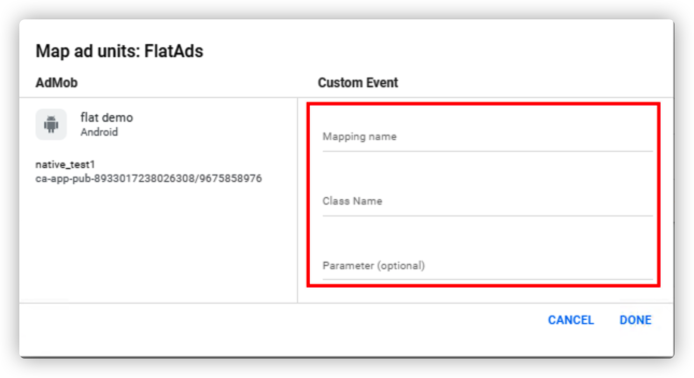

# Flat-AdMob-Adapter

## 发版记录

| 版本     | 发布时间       | 更新内容    |
|--------|------------|---------|
| 1.4.16 | 2023-05-26 | 发布第一个版本 |

## 引入Adapter

首先在项目级build.gradle文件加入maven远程依赖地址，如下：
```groovy
buildscript {
    repositories {
        maven { url "https://maven.flat-ads.com/repository/maven-public/"}
        maven { url "https://jitpack.io" }
    }
}
allprojects {
    repositories {
        maven { url "https://maven.flat-ads.com/repository/maven-public/"}
        maven { url "https://jitpack.io" }
    }
}

```
然后再Module的build.gradle中引入AdMob Adapter的包
```groovy

implementation "com.flatads.adapter:admob:1.4.16-GP"
implementation "com.flatads.sdk:flatads:1.4.16-GP"

```
## 在AdMob用户界面中定义Adapter
1. 需要在Mediation中添加FlatAds每个广告类型的信息，点击「Create mediation group」即可创建

2. 配置广告时「ADD CUSTOM EVENT」添加 FlatAds Adapter信息

3. 填写FlatAds Adapter相关信息
   
   1. Mapping name ： 当前创建类型名称，没有限制 
   2. Class Name : FlatAds Adapter对应广告类型的类名，需要加上包名 
      1. Banner ：com.flatads.adapter.admob.event.FlatBannerEvent 
      2. Native ：com.flatads.adapter.admob.event.FlatNativeEvent 
      3. Interstitial ：com.flatads.adapter.admob.event.FlatInterstitialEvent 
      4. Rewarded ：com.flatads.adapter.admob.event.FlatRewardEvent 
   3. Parameter ： 配置传给Adapter的参数，**格式必须为Json** 
      1. 例子：{"app_id":"EWAHVE8S","app_token":"uihjbnklnm78gyhu","ad_unit_id":"5d47fad0-b7a4-11eb-80ed-032568831082"} 
      2. **app_id、app_token、ad_unit_id 必须固定**，设置banner时可以添加banner_size选择banner样式，0 ：小样式（300 * 50） ，1 ： 大样式（300 * 250）
